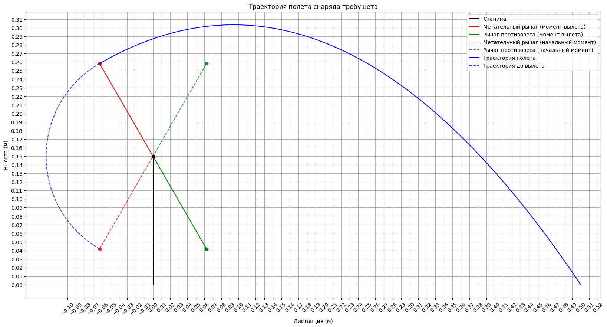

# Mechanics project

Дано:

Параметры катапульты:

$$
\alpha_{start}=240^{\circ}\ (начальный\ угол\ снаряда)\\
\alpha_{release}=30^{\circ}\ (угол\ вылета\ снаряда)\\
h_{frame}=0.15м\ (высота\ оси\ вращения\ рычага)\\
l_{arm}=0.25м\ (длина\ всего\ рычага)\\
k_{arm}=0.5\ (соотношение\ плеч\ рычага)\\
m_{arm}=0.018кг\ (масса\ всего\ плеча)
$$

Параметры запуска:

$$
m_{missile}=0.016кг\ (масса\ снаряда)\\
d=0.5м\ (расстояние\ которое\ снаряд\ должен\ пролететь\ от\ станины)\\
R_{missile}=0.008м\ (радиус\ снаряда)
$$

Введем некоторые переменные: (лучше не читать)

$$
\beta_{start\_missile}=\alpha_{start}+90^\circ=240^\circ\ (Угол\ рычага\ снаряда \ в \ начальный\ момент)\\
\beta_{release\_missile}=\alpha_{release}+90^\circ=120^\circ\ (Угол\ рычага\ снаряда \ в \ момент\ вылета )\\
\beta_{start\_weight}=\alpha_{start}+270^\circ=60^\circ\ (Угол\ рычага\ противовеса\ в \ начальный\ момент)\\
\beta_{release\_weight}=\alpha_{release}+270^\circ=300^\circ\ (Угол\ рычага\ противовеса\ в \ момент\ вылета)\\

l_{missile\_arm}=l_{missile}*(1-k_{arm})=0.125м\ (длина\ плеча\ снаряда)\\
l_{weight\_arm}=l_{missile}*k_{arm}=0.125м\ (длина\ плеча\ противовеса)\\
$$

Теперь рассчитаем положения снаряда и противовеса: (лучше не читать)

$$
x_{start\_missile}=\cos(\beta_{start\_missile})*l_{missile\_arm\_length}\\
y_{start\_missile}=\sin(\beta_{start\_missile})*l_{missile\_arm\_length}+h_{frame}\\

x_{start\_weight}=\cos(\beta_{start\_weight})*l_{_weight\_arm\_length}\\
y_{start\_weight}=\sin(\beta_{start\_weight})*l_{_weight\_arm\_length}+h_{frame}\\

x_{release\_missile}=\cos(\beta_{release\_missile})*l_{missile\_arm\_length}\\
y_{release\_missile}=\sin(\beta_{release\_missile})*l_{missile\_arm\_length}+h_{frame}\\

x_{release\_weight}=\cos(\beta_{release\_weight})*l_{_weight\_arm\_length}\\
y_{release\_weight}=\sin(\beta_{release\_weight})*l_{_weight\_arm\_length}+h_{frame}
$$

Рассчитаем начальную скорость v0 под углом вылета:

$$
x=x_{start\_missile}+v_0\cos(\alpha_{release})t\\

y=y_{start\_missile}+v_0\sin(\alpha_{release})t-\frac{gt^2}{2}\\
\\

Выразим\ t\ через\ x\\
t=\frac{x-x_{start\_missile}}{v_0\cos(\alpha_{release})}\\

Подставим\ в\ y\\
y=y_{start\_missile}+v_0\sin(\alpha_{release})(\frac{x-x_{start\_missile}}{v_0\cos(\alpha_{release})})-\frac{g(\frac{x-x_{start\_missile}}{v_0\cos(\alpha_{release})})^2}{2}\\

Упростим\\
y=y_{start\_missile}+(x-x_{start\_missile})\tan(\alpha_{release})-\frac{g(x-x_{start\_missile})^2}{2v_0\cos(\alpha_{release})}\\
\\

Выразим\ v_0\\
v_0=\frac{g(x-x_{start\_missile})^2}{2\cos^2(\alpha_{release})[(x-x_{start\_missile})\tan(\alpha_{release})-(y-y_{start\_missile})]}\\

Посчитаем\ v_0\\
v_0=\frac{9.81м/с^2 * (0.5м-(-0.0625м))^2}{2*0.75*[(0.5м-(-0.0625м))*0,578-(0м-0.258м)]}=1.90м/с
$$

Теперь выведем время полета, и закон движения:

$$
v_x=v_0\cos(\alpha_{release})=1.64м/с\ (скорость\ снаряда\ по\ x)\\
v_y=v_0\sin(\alpha_{release})=0.95м/с\ (скорость\ снаряда\ по\ y)\\

t_{path1}=\frac{v_y}{g}=0.0967с\ (время\ полета\ до\ наивысшей\ точки)\\
y_{max}=y_{release\_missile}+v_yt_{path1}-\frac{gt_{path1}^2}{2}=0.304м\ (наивысшая \ точка\ полета)\\
Из\ закона\ движения\ y\ выразим\ \\
t_{path2}=\frac{\sqrt{2y_{max}}}{g}=0.249с\\
t_{tot}=t_{path1}+t_{path2}=0.3456с
$$

Missile start point: (-0.06250000000000006; 0.041746824526945184)
Weight start point: (0.06250000000000006; 0.2582531754730548)
Missile release point: (-0.06249999999999997; 0.2582531754730548)
Weight release point: (0.06249999999999997; 0.041746824526945156)
239.99999999999997 119.99999999999999
0.21650635094610965
Launching missile with angle: 30.00 degrees and v0: 1.88 m/s
Weight mass: 0.03438221420742506
Vx: 1.6312813025047181, Vy: 0.9418206991251022
first_path_time 0.09603898366160742
max_y 0.3034789268407745
second_path_time 0.24878198568090912
total_time 0.34482096934251655
Flight time: 0.34482096934251655 s, x_move: 0.5624999999999999 m, y_move: -0.25825317547305493 m
Landed in: (0.4999999999999999; -1.1102230246251565e-16)

